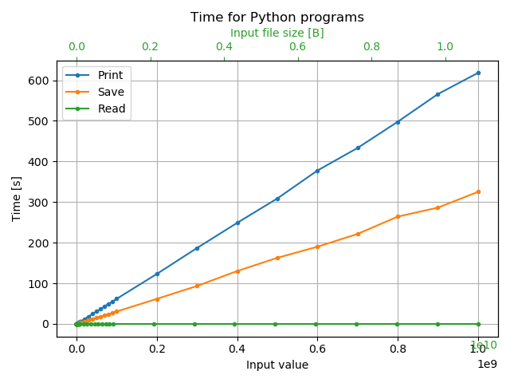
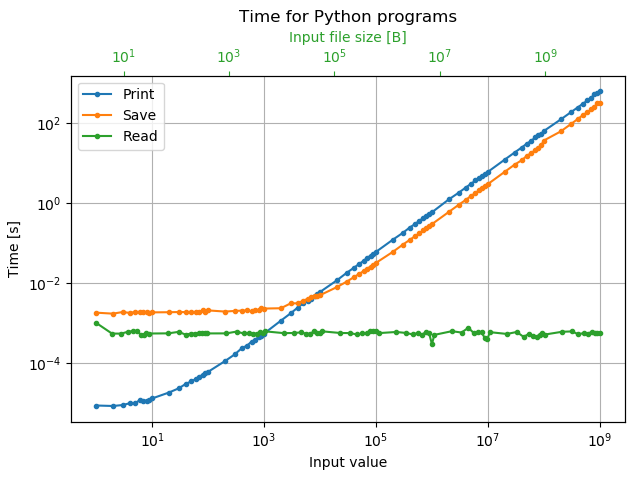
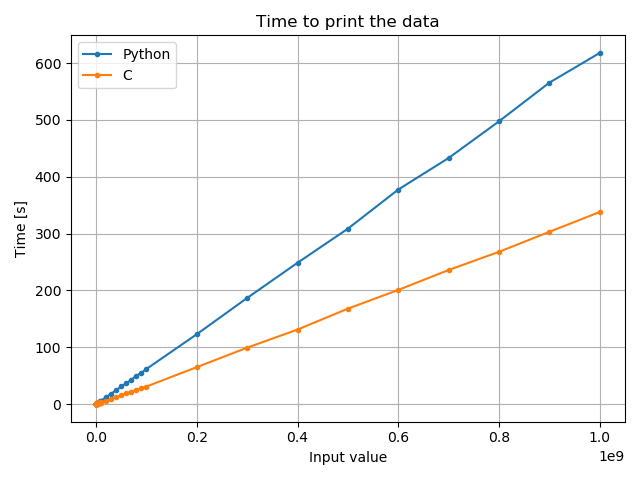
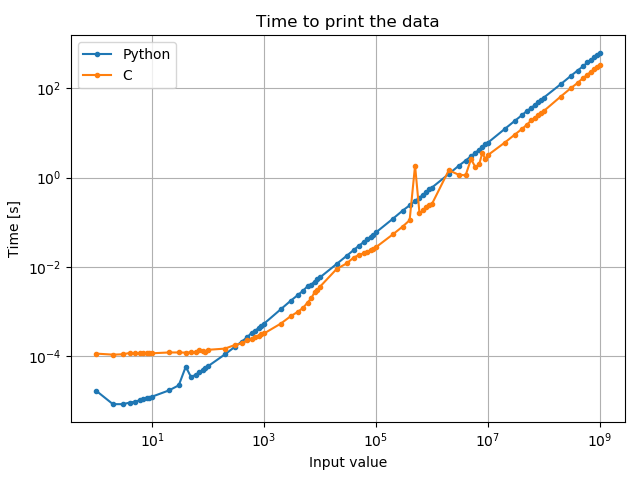
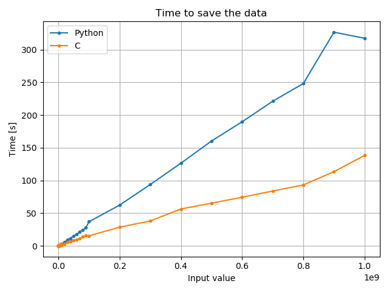
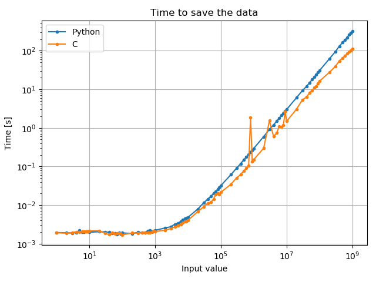
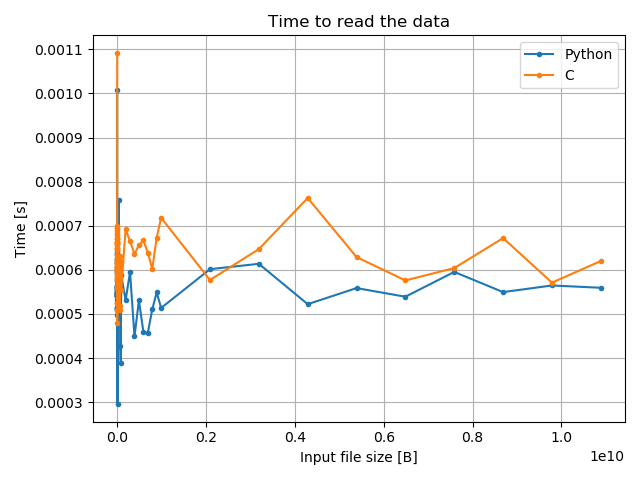
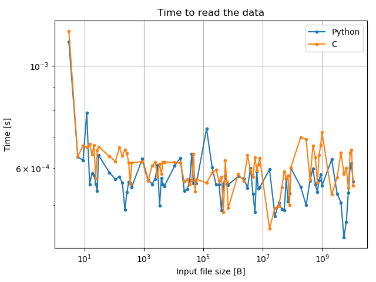
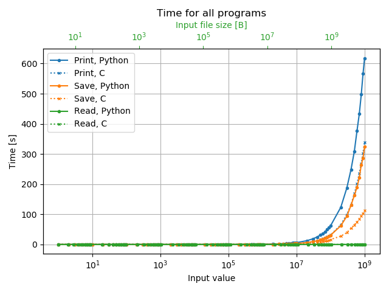
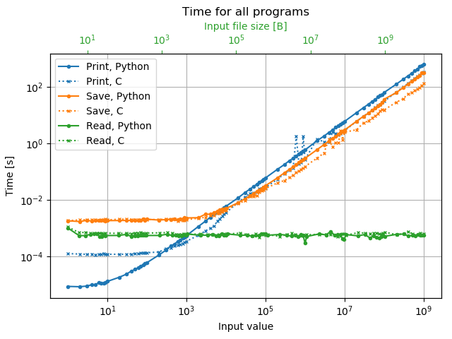

# Week 2

## Files in this directory

 - ```repeat_adder.py``` - slightly corrected version of the repeat_adder.py from the main repository for this course.

 - ```time_print.py```, ```time_print.c``` - do the same as the same files as in the main repository. Take an input integer and time how long it takes to print all non-negative integers lower than the input value to the console. They also append the input value and the time taken to run the file to ```./data/python_time_print_results.txt``` or ```./data/c_time_print_results.txt``` as the case my be.

 - ```time_save.py```, ```time_save.c``` - take an input integer and time how long it takes to open a new file, write all non-negative integers lower than the input value to the file and then save the file. This file is ```./data/python_time_out.txt``` or ```./data/c_time_out.txt```. They also append the input value and the time taken to run the file to ```./data/python_time_save_results.txt``` or ```./data/c_time_save_results.txt``` as the case my be.

 - ```time_read.py```, ```time_read.c``` - files to time how long it takes to open a file, read its contents and then close the files. The file that is opened is the file created by the corresponding ```time_save.*``` file. They also append the file size and the time taken to run the file to ```./data/python_time_read_results.txt``` or ```./data/c_time_read_results.txt``` as the case my be.

 - ```run_c.sh``` and ```run_python.sh``` - shell scripts to repeatedly run all three of the files in each language for a number of different inputs. Easily editable, but currently they use 1, 2, 3, .., 9, 10, 20, 30, .., 90, 100, .., 9e8, 1e9 as inputs for the python or c programs. Then delete the corresponding ```./data/python_time_out.txt``` or ```./data/c_time_out.txt``` as these files can be quite large and are not needed once the scripts have been run.

 - ```plotting.py``` - takes the data generated by the python and C programs and generates plots of the data.

All ```time_*.py``` and C files also print the time taken to the console (this of course is not counted in the timing).

Also, for all ```time_*.py``` and C files the time taken to open and append to the ```*_results.txt``` file is not included.

## Running the files

The python and C files should be run from a directory which contains a sub-directory named ```data```. The python files don't necessarily have to be in this directory however.

The C files should be compiled to a directory called ```bin```.

```run_c.sh``` and ```run_python.sh``` should be run in the directory which contains the data directory.

File structure for running the python or C files in isolation:
- ```directory_in_which_they_are_run/```
	- ```data/```

File structure for running the bash files:
- ```directory_in_which_they_are_run/```
	- ```data/```
	- ```bin/compiled_c_files```
 	- ```python_files```

On the servers I have ```data/``` and ```bin/``` folders in this directory but they are ignored by a ```.gitignore``` file.

I would also recommend running the ```.sh``` files in ```tmux``` as they can take a while to run.

When running ```plotting.py``` all data files must be present or an error will occur.

## Results

The plots are shown below, grouped by language and by task. There are also plots of all 6 tasks together. Each plot is given in linear and log-log scale.

[Note: for any plot including the time taken to save the data as well as the other tasks the size of the input file is displayed on the top x-axis, however in the linear scale the scale of 1e10 appears near the lower x-axis, I can't figure out how to fix this, but if I do I will remove this note and update the corresponding images.]

### Python plots



Performace of python programs on linear scale



Performace of python programs on log-log scale

### C plots


Performace of C programs on linear scale


Performace of C programs on log-log scale

### Printing plots



Comparison of the performace of each language when printing the numbers on linear scale



Comparison of the performace of each language when printing the numbers on log-log scale

### Writing plots



Comparison of the performace of each language when writing the numbers to a file on linear scale



Comparison of the performace of each language when writing the numbers to a file on log-log scale

### Reading plots



Comparison of the performace of each language when reading a file on linear scale



Comparison of the performace of each language when reading a file on log-log scale

### Plots of all processes



Comparison of the performace of each language for each task on linear scale



Comparison of the performace of each language for each task on log-log scale

## Analysis of results

For printing and writing to a file, at high input values (above about $10^3$) the C program is faster than python except for a few random datapoints where the C code takes longer. ~~If I get the chance I will re-run the files and see if I can get a dataset where this is not present as I expect these are random and hopefully will not be replicated.~~ I have re-run the code and the random points do still occur, I am unsure what is causing them.

For each language after an input of about $10^4$ the printing time is higher than the time to write and save to a file. This is likely because there is some constant time required to create, open and save a file, while the time taken to append to a file is lower than the time to print to the console. It appears that the constant time is similar between python and C, while the time to append to a file is faster in C than it is python.

For each language the time to read the file remains fairly constant for all file sizes and is similar for python and C.

It appears that C has some constant startup time to print, and after this the time taken increases linearly. While python also likely has some constant startup time it appears to be much lower and it begins to increase linearly much sooner than C does.
