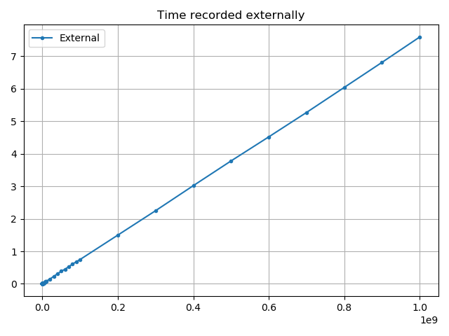
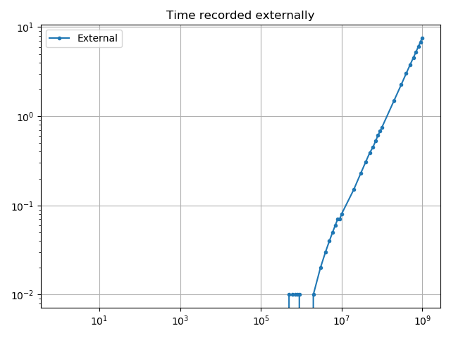
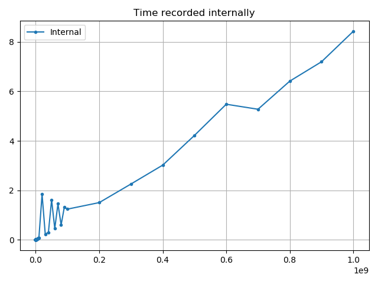
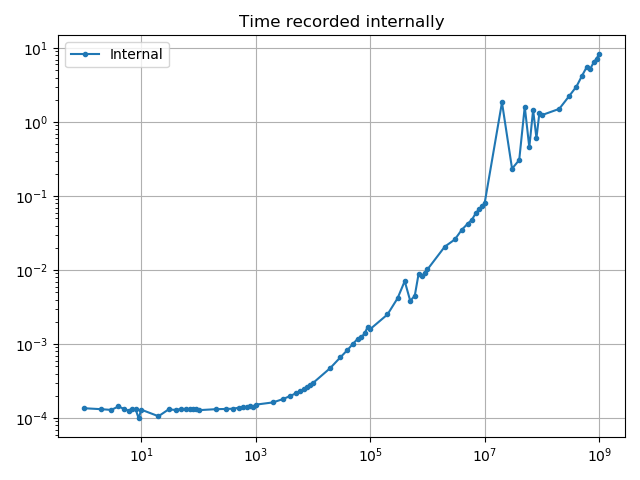
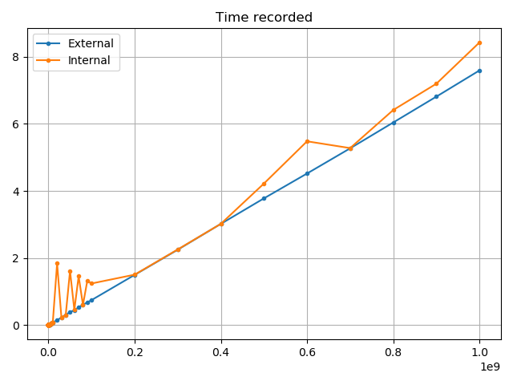
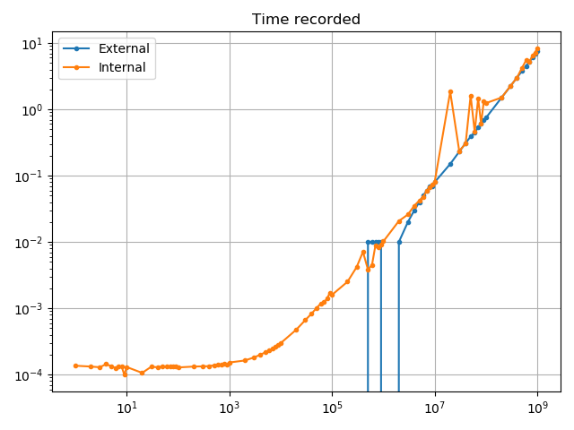

# Week 3

## Files in this directory

 - ```hello_world_mpi.c``` - Hello world program for MPI.  [AN MPI FILE]
 - ```hello_world_mpi_messing.c``` - The hello world program, messing around with putting MPI commands in the wrong order.  [AN MPI FILE]
 - ```hello_world.c``` - Hello world in serial.
 - ```timing_results.txt``` - The results from timing the different files. (Results also shown below).
 - ```proof.c``` - The ```proof.c``` file copied from the course repository.  [AN MPI FILE]
 - ```vector_serial.c``` - The ```vector_serial.c``` file copied from the course repository.
 - ```vector_serial_edited.c``` - The ```vector_serial.c``` file edited so that it sets the ith component of the vector to $i^2$.
 - ```vector_serial_internal.c``` - The ```vector_serial_edited.c``` file edited so that it outputs the time taken to run the program, as found internally.
 - ```run_external.sh``` - Runs ```vector_serial_edited.c``` repeatedly for a number of different inputs in order to find the time taken to run for a number of different inputs.
 - ```run_internal.sh``` - Runs ```vector_serial_internal.c``` repeatedly for a number of different inputs in order to find the time taken to run for a number of different inputs.
 - ```plotting_serial.py``` - Plots the data generated by ```run_external.sh``` and ```run_internal.sh```.
 - ```vector_parallel.c``` - Sum the vector in parallel.  [AN MPI FILE]
 - ```vector_parallel_internal.c``` - Sum the vector in parallel and time the process internally.  [AN MPI FILE]
 - ```time_internal_serial_parallel.sh``` - Runs ```vector_serial_internal.c``` and ```vector_parallel_internal.c``` repeatedly for a number of different inputs and number of processes in order to find the time taken to run for a number of different inputs.
 - ```time_external_serial_parallel.sh``` - Runs ```vector_serial_edited.c``` and ```vector_parallel.c``` repeatedly for a number of different inputs and number of processes in order to find the time taken to run for a number of different inputs. Also times the processes using the ```time``` shell command.

## Timing Results

Note: These were run once for each number of processors, this is by no means rigorous, just to get a bit of an idea.

For the parallel program, ```hello_world_mpi.c```

(All times in seconds)

| np | real  | usr   | sys   |
|----|-------|-------|-------|
| 1  | 0.360 | 0.065 | 0.080 |
| 2  | 0.361 | 0.098 | 0.096 |
| 3  | 0.404 | 0.120 | 0.110 |
| 4  | 0.415 | 0.122 | 0.164 |
| 5  | 0.375 | 0.196 | 0.148 |
| 6  | 0.417 | 0.149 | 0.227 |
| 7  | 0.424 | 0.163 | 0.263 |
| 8  | 0.432 | 0.227 | 0.251 |
| 9  | 0.434 | 0.245 | 0.275 |
| 10 | 0.445 | 0.264 | 0.299 |
| 11 | 0.444 | 0.297 | 0.337 |
| 12 | 0.454 | 0.300 | 0.344 |
| 13 | 0.464 | 0.332 | 0.360 |
| 14 | 0.476 | 0.388 | 0.396 |
| 15 | 0.470 | 0.350 | 0.464 |
| 16 | 0.475 | 0.339 | 0.527 |

For the serial program, ```hello_world.c```

| input | real  | usr   | sys   |
|-------|-------|-------|-------|
| 1     | 0.005 | 0.004 | 0.000 |
| 2     | 0.004 | 0.000 | 0.004 |
| 3     | 0.004 | 0.000 | 0.004 |
| 4     | 0.004 | 0.000 | 0.004 |
| 5     | 0.004 | 0.000 | 0.004 |
| 6     | 0.004 | 0.000 | 0.004 |
| 7     | 0.004 | 0.000 | 0.004 |
| 8     | 0.004 | 0.000 | 0.004 |
| 9     | 0.004 | 0.000 | 0.004 |
| 10    | 0.004 | 0.000 | 0.004 |
| 11    | 0.004 | 0.000 | 0.004 |
| 12    | 0.004 | 0.000 | 0.004 |
| 13    | 0.004 | 0.003 | 0.000 |
| 14    | 0.004 | 0.000 | 0.004 |
| 15    | 0.004 | 0.000 | 0.004 |
| 16    | 0.004 | 0.000 | 0.004 |

The parallel program is significantly slower than the serial counterpart, although of course the serial program doesn't have the additional overhead of creating a number of parallel processes. Also, the serial program has a consistent time for any input tested, while the serial program does tend to take longer as more processors are added. Notably the sum of usr and sys exceeds the real time for the parallel program for larger numbers of processors, while in the serial case the real time never exceeds this sum, and is usally equal to it.

## Documentation of proof.c

 - Import libraries.
 - Declare the functions.
 - ```main()```:
   - Declare and initialise some variables.
   - Use ```check_args()``` to check that the correct form of input was provided and then convert it to an integer.
   - Initialise the MPI process.
   - Find the rank of the current process and the size of the universe (MPI world size).
   - Call ```check_uni_size()``` with the size of the universe as an input to check the size of the universe is ok for the program to run.
   - Call ```check_task()``` to find out what it's supposed and then do it, to do based off of the universe size, its rank and the input value.
   - Finalise the MPI.
 - ```check_args()```:
   - Declare the numerical argument variable (the input), sets it to 0 initially.
   - Check that the correct number of arguments [program_name, numerical_argument] have been passed in.
   - If so:
      - Convert the second argument (the input value) to an integer.
   - Else:
      - Raise an error.
      - Give an example of the correct usage.
      - Close the program.
 - ```check_uni_size()```:
   - Set the minimum size of the universe to 1 process.
   - Check if the size of the universe is >= to the minimum size.
   - If so:
      - Exit this funtion, return to where it was called.
   - Else:
      - Raise an error.
      - Print the minimum universe size.
      - Print the size that was input.
      - Close the program.
 - ```check_task()```:
   - Check the rank of the process.
   - If root process (rank == 0):
      - Call ```root_task()``` with the size of the universe as an input.
   - Else:
      - Call ```client_task()``` with the rank of the process and the input value.
 - ```root_task()```:
   - Declare and initialise the variables dealing with transmission.
   - Set the count to 1.
   - Initialise the variable for the final output to 0.
   - Iterate through all other ranks.
      - Receive the message from the specific rank.
      - Add the received message to the output.
   - Print the combined output sum and return it
 - ```client_task()```:
   - Declare and initialise the variables dealing with transmission.
   - Set the count to 1.
   - Set the message destination to 0 (the root).
   - Create the message, which is rank * input_value.
   - Send the message to the root.

This essentially finds the (np-1)th triangular number, where np is the number of processes used, and multiplites it by whatever input (m) is provided. As such, a single-line expression for the output is $m \frac{np(np-1)}{2}$.

## Documentation of vector_serial.c
 - Import libraries.
 - Declare the functions.
 - ```main()```:
   - Use ```check_args()``` to check that the correct form of input was provided and then convert it to an integer.
   - Initialise the vector variable using ```malloc```.
   - Call ```initialise_vector()``` with the initialised vector, the input value (as the size of the vector) and 0 as inputs.
   - Call ```sum_vector()``` to find the sum of the vector, taking the vector and the input value.
   - Print what was found by ```sum_vector()```.
 - ```sum_vector()```:
   - Take in a vector and size.
   - Create the variable to store the sum.
   - Loop through the elements of the vector and add them to the sum.
   - Return the sum.
 - ```initialise_vector()```:
   - Take in a vector, the size of the vector and some initial value as inputs.
   - Loop through all elements of the vector and set each to the initial value.
 - ```print_vector()```:
   - Take in a vector and size.
   - Loop through each element of the vector and print each value to the console separately.
 - ```check_args()```:
   - Declare the numerical argument variable (the input), sets it to 0 initially.
   - Check that the correct number of arguments [program_name, numerical_argument] have been passed in.
   - If so:
      - Convert the second argument (the input value) to an integer.
   - Else:
      - Raise an error.
      - Give an example of the correct usage.
      - Close the program.


## Timing vector_serial_edited.c
```vector_serial.c``` was edited to instead set element i of the vector to (initial value + i)^2 rather than just intial value. The initial value was left at 0. This does lead to overflows for large arrays.

For low values, when timing the files externally, the precision was low enough that 0.00 s were recorded, as such there are sections of the log-log graphs where there is no data shown for the external processes, this is a product of the precision available unfortunately.

### External timing


The time recorded externally on a linear scale.



The time recorded externally on a log-log scale.

### Internal timing


The time recorded internally on a linear scale.



The time recorded internally on a log-log scale.

### Both timings


The time recorded internally and exteranlly on a linear scale.



The time recorded internally and exteranlly on a log-log scale.

## Comparison of serial and parallel computation
The time taken to sum the first 1860 square numbers, in steps of 10, was found for the serial case and for the parallel case with all numbers of processors from 2 to 16. 1860 was chosen as this was the last value before which integer overflows occur when performing the sum. They were benchmarked internally and externally.
